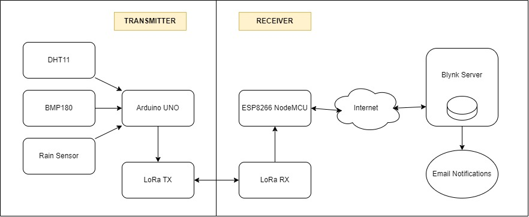
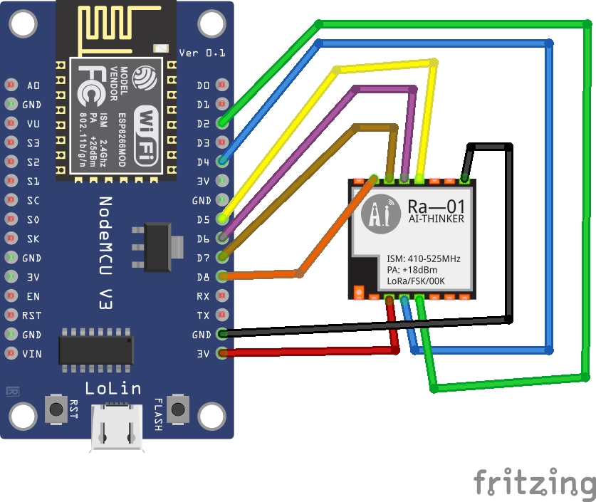
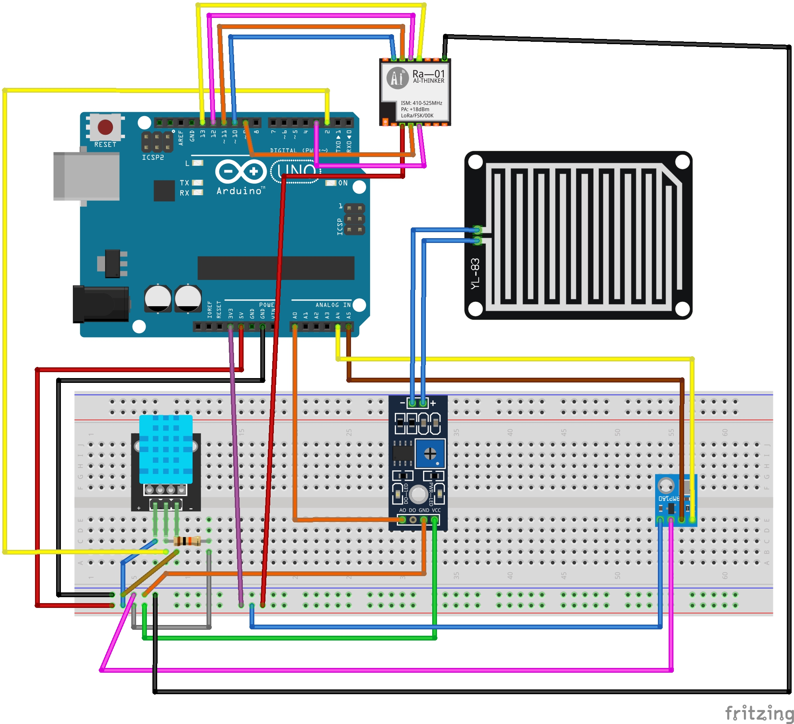
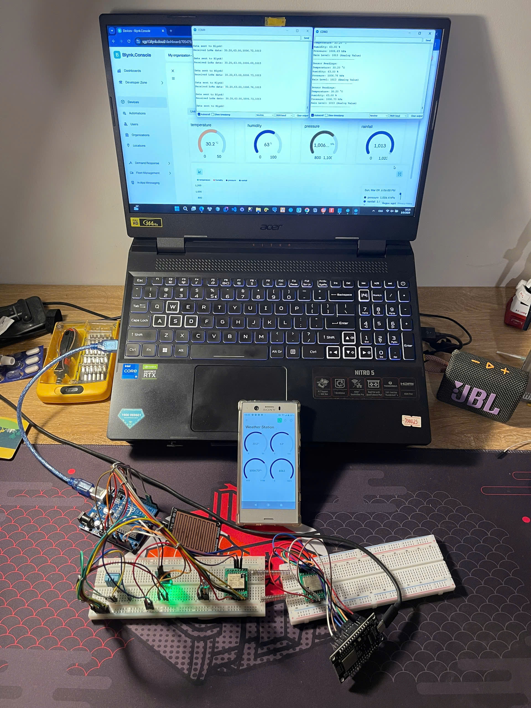

# IOT WEATHER STATION

## Members:
| # | Student ID | Student Name        |
|---|------------|---------------------|
| 1 | SE184005   | Tran Dinh Son       |
| 2 | SE192052   | Truong Le Huy Hoang |
| 3 | SE182173   | Nguyen Binh Minh    |
| 4 | SE182141   | Vo Nhat Thien       |

## About:

## System Model and Block Diagram:

  
Block Diagram

  

  
Design View

  <figure>
    
    <figcaption>ESP8266</figcaption>
  </figure>

     
  
  <figure>
    
    <figcaption>Arduino</figcaption>
  </figure>

  
Final Product

  <firgure>
    
    <figcaption>IOT Weather Station</figcaption>
  </firgure>

## Components List:

### Transmitter Side (Arduino UNO ↔ Sensors & LoRa RA‑01 Transmitter)

| Arduino UNO | DHT11 Sensor | BMP180 Sensor | Rain Sensor       | LoRa RA‑01 Module (Transmitter) |
|-------------|--------------|---------------|-------------------|------------------------------------|
| GND         | GND          | GND           | GND               | GND                                |
| VCC (5V)    | VCC (5V)     |               | VCC (5V)          |                                    |
| A0          |              |               | AO (Analog Out)   |                                    |
| A4          |              | SDA           |                   |                                    |
| A5          |              | SCL           |                   |                                    |
| D2          | Data         |               |                   |                                    |
| D3          |              |               |                   | DIO0                               |
| D9          |              |               |                   | RST                                |
| D10         |              |               |                   | NSS (CS)                           |
| D11         |              |               |                   | MOSI                               |
| D12         |              |               |                   | MISO                               |
| D13         |              |               |                   | SCK                                |
| VCC (3.3V)  |              | VCC (3.3V)    |                   | VCC (3.3V)                         |

---

### Receiver Side (NodeMCU ESP8266 ↔ LoRa RA‑01 Receiver)

| NodeMCU (ESP8266) | LoRa RA‑01 Module (Receiver) |
|-------------------|---------------------------------|
| GND               | GND                             |
| VCC (3.3V)        | VCC (3.3V)                      |
| D5 (GPIO14)       | SCK                             |
| D6 (GPIO12)       | MISO                            |
| D7 (GPIO13)       | MOSI                            |
| D8 (GPIO15)       | NSS (CS)                        |
| D4 (GPIO16)       | RST                             |
| D2 (GPIO5)        | DIO0                            |

